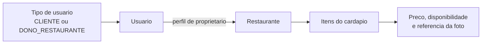
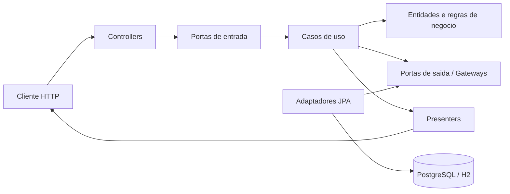

# Restaurant Management API - Phase 2


API REST desenvolvida para centralizar o gerenciamento de usuarios, perfis de acesso, restaurantes e itens de cardapio. A aplicacao implementa o fluxo completo de cadastro e manutencao dessas entidades, aplica regras de negocio antes da persistencia e oferece contratos HTTP documentados para integracao com clientes externos.

O projeto foi estruturado com Clean Architecture para separar o dominio das tecnologias de entrega e persistencia. O nucleo da aplicacao nao depende de Spring MVC, JPA ou PostgreSQL; esses componentes ficam nas camadas externas e se conectam aos casos de uso por meio de portas e adaptadores. Essa organizacao facilita testes, manutencao e substituicao de detalhes de infraestrutura.

Além dos CRUDs, a solucao inclui validacao de dados, tratamento global de erros, documentacao OpenAPI, health checks, ambiente Docker Compose, collection Postman executavel, testes unitarios e de integracao, regras arquiteturais com ArchUnit e cobertura minima de 80% verificada automaticamente pelo JaCoCo.

## Sumario

- [Video de demonstracao](#video-de-demonstracao)
- [Tecnologias](#tecnologias)
- [Visao funcional](#visao-funcional)
- [Arquitetura](#arquitetura)
- [Funcionalidades implementadas](#funcionalidades-implementadas)
- [Regras de negocio](#regras-de-negocio)
- [Dados iniciais](#dados-iniciais)
- [Execucao com Docker](#como-rodar-com-docker)
- [Execucao local](#como-rodar-localmente)
- [Swagger e endpoints](#swagger)
- [Exemplos de requisicoes](#exemplos---tipos-de-usuario-reutilizaveis)
- [Erros](#regras-de-erro)
- [Banco de dados](#banco-de-dados)
- [Postman](#postman)
- [Testes](#testes)
- [Documentacao complementar](#documentacao-complementar)

## Visao funcional

O modelo funcional parte de um catalogo fechado de tipos de usuario. Cada usuario referencia um desses tipos; usuarios com perfil `DONO_RESTAURANTE` podem ser associados a restaurantes, e cada restaurante pode possuir varios itens de cardapio.



As associacoes representam relacoes muitos-para-um: varios usuarios reutilizam um mesmo tipo, varios restaurantes podem pertencer a um proprietario e varios itens podem compor o cardapio de um restaurante. A API impede associacoes invalidas, como cadastrar um restaurante para um usuario cliente ou vincular um item a um restaurante inexistente.

## Video de demonstracao

O video apresenta a aplicacao, a Clean Architecture, os CRUDs, o Swagger, o Docker Compose, os testes e a cobertura em aproximadamente cinco minutos.

[Assistir ao video do Tech Challenge](output/video/TECH%20CHALLENGE%20-%20FASE%202.mp4)

## Tecnologias

- Java 17
- Spring Boot
- Spring Web
- Spring Data JPA
- Spring Validation
- PostgreSQL
- Lombok
- Springdoc OpenAPI / Swagger
- Maven
- Docker e Docker Compose
- JUnit 5, Mockito, MockMvc e ArchUnit

## Arquitetura

O projeto utiliza Clean Architecture com a regra de dependencia apontando para o nucleo. Dominio e aplicacao nao dependem de Spring, JPA, controllers, DTOs HTTP ou banco de dados.



Responsabilidades:

- `domain`: entidades puras, validacoes e excecoes de negocio.
- `application/port/in`: contratos dos casos de uso e comandos independentes de HTTP.
- `application/service/impl`: orquestracao dos casos de uso.
- `application/port/out`: contratos de gateways necessarios pelos casos de uso.
- `presentation`: controllers, DTOs HTTP, presenters e tratamento das respostas de erro.
- `infrastructure`: composicao Spring, modelos JPA, repositories, mapeadores e adaptadores de persistencia.

```text
src/main/java/com/restaurantsystem/restaurantmanagementapi
|-- application
|   |-- port
|   |   |-- in
|   |   |   `-- command          # input boundaries e dados de entrada internos
|   |   `-- out                  # output boundaries / gateways
|   `-- service/impl             # casos de uso sem dependencia de framework
|-- domain
|   |-- entity                   # entidades puras e invariantes do negocio
|   `-- exception
|-- infrastructure
|   |-- config                   # composicao dos casos de uso como beans
|   `-- persistence
|       |-- adapter              # implementacoes das portas de saida
|       |-- entity               # modelos exclusivos do JPA
|       |-- jpa                  # interfaces Spring Data
|       `-- mapper               # traducao modelo JPA <-> dominio
`-- presentation
    |-- controller
    |-- dto
    |   |-- request
    |   `-- response
    |-- exception                # tratamento e contrato de erros HTTP
    `-- presenter                # entidade de dominio -> resposta HTTP

src/test
|-- java
|   |-- application/service/impl  # casos de uso isolados com gateways mockados
|   |-- architecture              # regras de dependencia com ArchUnit
|   |-- domain/entity             # invariantes das entidades
|   |-- integration               # fluxo completo com Spring Boot e H2
|   `-- presentation
|       |-- controller            # testes HTTP com MockMvc
|       `-- exception             # contrato global de erros HTTP
`-- resources
    |-- application-test.properties
    `-- archunit.properties
```

O desenho segue os conceitos usados nas aulas de Clean Architecture: Entities, Use Cases, Interface Adapters (Controllers, Gateways e Presenters) e Frameworks & Drivers. O ArchUnit impede regressao das regras de dependencia durante o build.

## Funcionalidades Implementadas

- Health check da API.
- CRUD do catalogo fechado de tipos de usuario em `/user-types`.
- Somente `CLIENTE` e `DONO_RESTAURANTE` sao aceitos; cada tipo e cadastrado uma vez e reutilizado por varios usuarios.
- CRUD de usuarios em `/users`.
- Associacao `User` muitos-para-um com `UserType`.
- CRUD de restaurantes em `/restaurants`.
- Associacao `Restaurant` muitos-para-um com `User`.
- Validacao de que o dono do restaurante existe.
- Validacao de que o dono do restaurante possui `UserType` com nome `DONO_RESTAURANTE`.
- CRUD de itens do cardapio em `/menu-items`.
- Associacao `MenuItem` muitos-para-um com `Restaurant`.
- Busca dos itens de um restaurante em `/restaurants/{restaurantId}/menu-items`.
- Validacao de nome obrigatorio, preco positivo e restaurante obrigatorio/existente.
- Teste de integracao cobrindo tipo de usuario, dono, restaurante, item e listagens.
- Cobertura verificada automaticamente pelo JaCoCo, com minimo obrigatorio de 80% das linhas.
- Respostas de erro padronizadas, sem exposicao de detalhes internos em erros inesperados.
- Tratamento global para validacao, entidade nao encontrada, regra de negocio e integridade de dados.

## Qualidade, Testes e Entrega

A qualidade e tratada como parte do ciclo de build, e nao como uma etapa isolada. O comando `mvn clean verify` compila a aplicacao, executa todos os niveis de teste, gera o relatorio de cobertura e interrompe o build se o limite minimo nao for atendido.

- JaCoCo integrado ao ciclo Maven; `mvn verify` falha se a cobertura de linhas ficar abaixo de 80%.
- Teste de integracao com banco H2 isolado no perfil `test`.
- Fluxo integrado: criar os dois tipos permitidos, reutiliza-los entre varios usuarios, criar dono, restaurante, item e listar os dados.
- Tratamento explicito para validacao, JSON invalido, parametro de rota invalido, recurso inexistente, conflito de integridade e erro inesperado.
- Health checks do PostgreSQL e da aplicacao no Docker Compose.
- Collection Postman reorganizada para funcionar no Collection Runner, incluindo limpeza em ordem segura.

## Regras de Negocio

### Tipos de Usuario

O tipo de usuario e um catalogo fechado com exatamente duas opcoes: `CLIENTE` e `DONO_RESTAURANTE`.

Regras:

- `name` e obrigatorio e aceita somente `CLIENTE` ou `DONO_RESTAURANTE`.
- Os ids sao fixos: `1` identifica `CLIENTE` e `2` identifica `DONO_RESTAURANTE`.
- Os dois tipos sao criados automaticamente; use `GET /user-types` para consultar o catalogo em vez de repetir o `POST`.
- O mesmo `userTypeId` pode ser reutilizado por qualquer quantidade de usuarios; por exemplo, cinco clientes podem apontar para o mesmo registro `CLIENTE`.
- O nome e normalizado para letras maiusculas e permanece unico sem diferenciar maiusculas de minusculas.
- Um tipo compartilhado por usuarios nao pode ser renomeado; para alterar apenas o perfil de uma pessoa, use `PUT /users/{id}` com o outro `userTypeId`.
- Um tipo de usuario em uso por usuarios nao pode ser removido.
- Na inicializacao com PostgreSQL, os dois registros do catalogo sao garantidos automaticamente nos ids corretos. Tipos legados com nome de dono sao consolidados em `DONO_RESTAURANTE`; os demais sao consolidados em `CLIENTE`, preservando os usuarios existentes com o menor privilegio.
- A migracao de compatibilidade tambem normaliza campos obrigatorios de usuarios legados. E-mails antigos no formato `usuario@dominio` recebem o sufixo `.local`; outros valores invalidos recebem um e-mail tecnico unico baseado no id. As validacoes permanecem obrigatorias para novos cadastros.

### Cadastro de Restaurantes

O cadastro de restaurante permite registrar os dados operacionais do restaurante e associar um dono.

Campos:

- `name`
- `address`
- `cuisineType`
- `openingHours`
- `ownerId`

Regras:

- Todos os campos sao obrigatorios.
- `ownerId` deve referenciar um usuario existente.
- O usuario dono deve possuir tipo de usuario `DONO_RESTAURANTE`.
- Controllers retornam DTOs, nao entidades JPA.
- A resposta do dono nao expoe senha nem dados sensiveis.

### Itens do Cardapio

Cada item do cardapio pertence a um restaurante existente.

Campos:

- `name`
- `description`
- `price`
- `availableOnlyInRestaurant`
- `photoPath`
- `restaurantId`

Regras:

- `name` e obrigatorio e nao pode ser vazio.
- `price` e obrigatorio e deve ser maior que zero.
- `restaurantId` e obrigatorio e deve referenciar um restaurante existente.
- O caminho da foto e armazenado como texto; a API nao realiza upload de imagens.
- A resposta apresenta apenas `id` e `name` do restaurante associado.

## Dados Iniciais

Na primeira inicializacao de uma base vazia, a aplicacao cria somente os dois tipos e um usuario de exemplo para cada tipo:

| Registro | ID | Nome | Login | E-mail | Senha | Tipo |
|----------|----|------|-------|--------|-------|------|
| Tipo de usuario | 1 | `CLIENTE` | - | - | - | - |
| Tipo de usuario | 2 | `DONO_RESTAURANTE` | - | - | - | - |
| Usuario | 1 | Cliente Exemplo | `cliente` | `cliente@exemplo.com` | `123456` | `CLIENTE` (ID 1) |
| Usuario | 2 | Dono de Restaurante Exemplo | `dono` | `dono@exemplo.com` | `123456` | `DONO_RESTAURANTE` (ID 2) |

Restaurantes e itens de cardapio iniciam vazios. O seed so e executado quando a tabela de usuarios esta vazia, portanto reiniciar a aplicacao nao duplica usuarios nem apaga dados cadastrados.

Para recriar exatamente esse estado inicial com Docker, remova o volume local e suba os servicos novamente. O primeiro comando apaga todos os dados locais do PostgreSQL deste projeto:

```bash
docker compose down -v
docker compose up --build -d
```

## Como Rodar com Docker

```bash
docker compose up --build
```

Para executar em segundo plano e conferir o estado dos containers:

```bash
docker compose up --build -d
docker compose ps
docker compose logs -f app
```

Servicos expostos:

- API: `http://localhost:8080`
- PostgreSQL: `localhost:5432`
- Banco: `restaurant_db`
- Usuario: `postgres`
- Senha: `postgres`

Health check:

```bash
curl http://localhost:8080/health
```

Para encerrar sem apagar os dados:

```bash
docker compose down
```

Para apagar tambem o volume do PostgreSQL e iniciar com banco vazio:

```bash
docker compose down -v
```

## Como Rodar Localmente

Pre-requisitos:

- JDK 17 ou superior.
- Maven 3.9 ou Maven Wrapper.
- PostgreSQL 16, local ou pelo Docker Compose.

Suba um PostgreSQL local ou use apenas o servico de banco do Docker Compose. A aplicacao usa estes valores padrao:

```properties
spring.datasource.url=jdbc:postgresql://localhost:5432/restaurant_db
spring.datasource.username=postgres
spring.datasource.password=postgres
```

Executar a aplicacao:

```bash
mvn spring-boot:run
```

Executar os testes:

```bash
mvn clean verify
```

## Swagger

Com a aplicacao rodando, a documentacao OpenAPI pode ser acessada em:

```text
http://localhost:8080/swagger-ui/index.html
```

Os controllers possuem grupos, parametros, exemplos e descricoes de operacoes. O Swagger documenta respostas `200`, `201`, `204`, `400`, `404` e `409` conforme cada endpoint. Nos schemas de tipo de usuario, o campo `name` apresenta somente `CLIENTE` e `DONO_RESTAURANTE` como valores permitidos.

## Endpoints

| Metodo | Endpoint              | Descricao                                  |
|--------|-----------------------|--------------------------------------------|
| GET    | `/health`             | Health check                               |
| POST   | `/user-types`         | Cadastrar um tipo permitido se ele nao existir (o seed ja cria ambos) |
| GET    | `/user-types`         | Listar tipos de usuario                    |
| GET    | `/user-types/{id}`    | Buscar tipo de usuario por ID              |
| PUT    | `/user-types/{id}`    | Atualizar nome do tipo de usuario          |
| DELETE | `/user-types/{id}`    | Deletar tipo se nao estiver em uso         |
| POST   | `/users`              | Criar usuario com `userTypeId`             |
| GET    | `/users`              | Listar usuarios                            |
| GET    | `/users/{id}`         | Buscar usuario por ID                      |
| PUT    | `/users/{id}`         | Atualizar usuario, inclusive `userTypeId`  |
| DELETE | `/users/{id}`         | Deletar usuario                            |
| POST   | `/restaurants`        | Criar restaurante com `ownerId`            |
| GET    | `/restaurants`        | Listar restaurantes                        |
| GET    | `/restaurants/{id}`   | Buscar restaurante por ID                  |
| PUT    | `/restaurants/{id}`   | Atualizar restaurante, inclusive `ownerId` |
| DELETE | `/restaurants/{id}`   | Deletar restaurante                        |
| POST   | `/menu-items`         | Criar item para um restaurante             |
| GET    | `/menu-items`         | Listar todos os itens                      |
| GET    | `/menu-items/{id}`    | Buscar item por ID                         |
| GET    | `/restaurants/{restaurantId}/menu-items` | Listar itens de um restaurante |
| PUT    | `/menu-items/{id}`    | Atualizar item, inclusive seu restaurante  |
| DELETE | `/menu-items/{id}`    | Deletar item                               |

## Exemplos - Tipos de Usuario Reutilizaveis

Os dois tipos ja sao criados na inicializacao. Um novo `POST` com o mesmo nome retorna `400 Bad Request` e a mensagem `User type already registered. Reuse its id when creating users`, pois o registro deve ser reutilizado:

```http
POST /user-types
Content-Type: application/json
```

```json
{
  "name": "DONO_RESTAURANTE"
}
```

O registro existente de dono possui este formato:

```json
{
  "id": 2,
  "name": "DONO_RESTAURANTE"
}
```

Antes de cadastrar usuarios, consulte os ids disponiveis:

```http
GET /user-types
```

```json
[
  { "id": 1, "name": "CLIENTE" },
  { "id": 2, "name": "DONO_RESTAURANTE" }
]
```

Os registros acima sao compartilhados. Nao e necessario criar outro `CLIENTE` para cada pessoa: todos os clientes podem usar `userTypeId: 1`, enquanto todos os donos podem usar `userTypeId: 2`.

## Exemplos - Usuarios

Criar usuario dono de restaurante:

```http
POST /users
Content-Type: application/json
```

```json
{
  "name": "Joao Silva",
  "email": "joao@email.com",
  "login": "joaosilva",
  "password": "123456",
  "userTypeId": 2,
  "address": {
    "street": "Rua Central",
    "number": "100",
    "neighborhood": "Centro",
    "city": "Sao Paulo",
    "state": "SP",
    "zipCode": "01001000",
    "complement": "Sala 12"
  }
}
```

## Exemplos - Restaurantes

Criar restaurante:

```http
POST /restaurants
Content-Type: application/json
```

```json
{
  "name": "Restaurante Sabor Brasil",
  "address": "Rua das Flores, 123 - Sao Paulo/SP",
  "cuisineType": "Brasileira",
  "openingHours": "Segunda a sabado, das 11h as 23h",
  "ownerId": 2
}
```

Resposta:

```json
{
  "id": 1,
  "name": "Restaurante Sabor Brasil",
  "address": "Rua das Flores, 123 - Sao Paulo/SP",
  "cuisineType": "Brasileira",
  "openingHours": "Segunda a sabado, das 11h as 23h",
  "owner": {
    "id": 2,
    "name": "Dono de Restaurante Exemplo",
    "email": "dono@exemplo.com",
    "userType": {
      "id": 2,
      "name": "DONO_RESTAURANTE"
    }
  }
}
```

Atualizar restaurante:

```http
PUT /restaurants/1
Content-Type: application/json
```

```json
{
  "name": "Restaurante Sabor Brasil Unidade Centro",
  "address": "Rua das Flores, 456 - Sao Paulo/SP",
  "cuisineType": "Brasileira",
  "openingHours": "Todos os dias, das 11h as 23h",
  "ownerId": 2
}
```

## Fluxo Minimo no Postman

1. `GET /user-types` para conferir `CLIENTE` no ID 1 e `DONO_RESTAURANTE` no ID 2.
2. `GET /users` para conferir os dois usuarios iniciais.
3. `POST /users` quantas vezes forem necessarias, reutilizando o `userTypeId` correspondente.
4. `POST /restaurants` usando o `ownerId` de um usuario `DONO_RESTAURANTE`, como o usuario inicial de ID 2.
5. `GET /restaurants/{id}`.
6. `PUT /restaurants/{id}`.
7. `POST /menu-items` usando o `restaurantId` criado.
8. `GET /restaurants/{restaurantId}/menu-items`.
9. `PUT /menu-items/{id}`.
10. `DELETE /menu-items/{id}`.
11. `DELETE /restaurants/{id}`.

## Exemplos - Itens do Cardapio

Criar item:

```http
POST /menu-items
Content-Type: application/json
```

```json
{
  "name": "Feijoada",
  "description": "Feijoada completa com acompanhamentos",
  "price": 39.90,
  "availableOnlyInRestaurant": true,
  "photoPath": "/images/feijoada.jpg",
  "restaurantId": 1
}
```

Resposta:

```json
{
  "id": 1,
  "name": "Feijoada",
  "description": "Feijoada completa com acompanhamentos",
  "price": 39.90,
  "availableOnlyInRestaurant": true,
  "photoPath": "/images/feijoada.jpg",
  "restaurant": {
    "id": 1,
    "name": "Restaurante Sabor Brasil"
  }
}
```

## Regras de Erro

- `404 Not Found`: usuario, tipo de usuario, restaurante ou item do cardapio inexistente.
- `400 Bad Request`: campos invalidos, tipo diferente de `CLIENTE`/`DONO_RESTAURANTE`, tipo ja cadastrado, preco nao positivo, e-mail/login duplicado, owner sem tipo `DONO_RESTAURANTE` ou tentativa de deletar tipo de usuario em uso.
- `409 Conflict`: violacao de integridade do banco.

Formato padrao:

```json
{
  "timestamp": "2026-07-12T20:00:00",
  "status": 400,
  "error": "Bad Request",
  "message": "Restaurant owner must have user type DONO_RESTAURANTE",
  "path": "/restaurants"
}
```

## Banco de Dados

O projeto usa `spring.jpa.hibernate.ddl-auto=update`. O arquivo `src/main/resources/schema.sql` complementa a inicializacao das tabelas.

Modelo principal:

- `user_types`: `id`, `name`
- `users`: coluna `user_type_id`
- `restaurants`: `id`, `name`, `address`, `cuisine_type`, `opening_hours`, `owner_id`
- `menu_items`: `id`, `name`, `description`, `price`, `available_only_in_restaurant`, `photo_path`, `restaurant_id`

## Postman

A collection esta em:

```text
postman/Restaurant-Management-API-Phase-2.postman_collection.json
```

Ela contem requests para health check, CRUD de tipos de usuario, CRUD de usuarios, CRUD de restaurantes e CRUD de itens do cardapio, incluindo a busca por restaurante. Ha exemplos separados de dono e cliente reutilizando os ids do catalogo.

Para executar toda a collection no Runner:

1. Inicie a aplicacao. A base vazia ja recebe `CLIENTE` (ID 1), `DONO_RESTAURANTE` (ID 2) e um usuario de cada tipo.
2. Importe a collection.
3. Confirme `baseUrl=http://localhost:8080`.
4. Execute as pastas na ordem apresentada.
5. Se um tipo ja existir, a collection consulta `GET /user-types` e reutiliza automaticamente seu id.
6. O ultimo request de `Menu Items` remove o item; depois, a pasta `Cleanup` remove o restaurante e os usuarios criados pelo Runner na ordem das chaves estrangeiras. Os dois usuarios iniciais e os dois tipos permanecem cadastrados.

Todos os requests possuem validacao automatica de status HTTP e formato JSON quando existe corpo na resposta.

## Testes

Executar testes, gerar o relatorio JaCoCo e validar a cobertura minima:

```bash
mvn clean verify
```

O relatorio HTML e gerado em:

```text
target/site/jacoco/index.html
```

Ultima validacao:

- 79 testes executados, incluindo 4 regras arquiteturais.
- 0 falhas, 0 erros e 0 testes ignorados.
- 91,22% de cobertura de linhas consideradas pelo JaCoCo (592 de 649).
- Build interrompido automaticamente se a cobertura ficar abaixo de 80%.

Estrategia de testes:

- `UserTypeServiceImplTest`: regras principais de tipo de usuario.
- `UserServiceImplTest`: CRUD de usuario, duplicidade de e-mail/login e associacao com tipo.
- `RestaurantServiceImplTest`: CRUD de restaurante, owner inexistente e owner com tipo invalido.
- `UserTypeControllerTest`: endpoints principais de `/user-types`.
- `RestaurantControllerTest`: endpoints principais de `/restaurants`.
- `MenuItemServiceImplTest`: CRUD, associacao e busca de itens por restaurante.
- `MenuItemControllerTest`: endpoints, rota por restaurante e validacoes dos itens de cardapio.
- `DomainEntityTest`: invariantes e alteracoes controladas nas entidades puras.
- `CleanArchitectureTest`: independencia do dominio, direcao das dependencias e isolamento da infraestrutura.
- `GlobalExceptionHandlerTest`: status e mensagens seguras do contrato global de erros.
- `MainFlowIntegrationTest`: fluxo real entre controllers, casos de uso, gateways, JPA e banco H2.

DTOs HTTP, modelos JPA com codigo gerado pelo Lombok, configuracoes e classe de inicializacao nao entram na metrica. Entidades de dominio, casos de uso, controllers, presenters, gateways, mapeadores de persistencia e tratamento de excecoes permanecem cobertos pela regra de 80%.

## Documentacao Complementar

O README concentra a visao completa do projeto e o fluxo de uso. Para consultas especializadas, os guias abaixo aprofundam cada assunto sem substituir as informacoes desta pagina:

- [Guia detalhado da API](docs/API.md): endpoints agrupados por recurso, payloads, regras, codigos de resposta e contrato de erros.
- [Arquitetura](docs/ARCHITECTURE.md): camadas, direcao das dependencias, fluxo de uma requisicao e persistencia.
- [Guia de desenvolvimento](docs/DEVELOPMENT.md): preparacao do ambiente, configuracao, testes, banco de dados e checklist de alteracoes.
- [Collection Postman](postman/Restaurant-Management-API-Phase-2.postman_collection.json): requisicoes e validacoes automatizadas para o fluxo completo.
