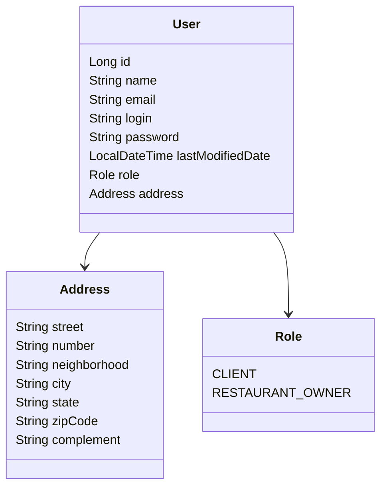

# Restaurant Management API

> Projeto desenvolvido para o **Tech Challenge — Fase 01** da Pós-Tech em Arquitetura e Desenvolvimento Java. A aplicação consiste em um backend REST para gerenciamento de usuários de um sistema compartilhado de restaurantes, contemplando cadastro, consulta, atualização, exclusão, troca de senha e validação de login, com persistência em banco relacional PostgreSQL e execução via Docker Compose.

---

## Sumário

1. [Contexto Acadêmico](#contexto-acadêmico)
2. [Objetivo do Projeto](#objetivo-do-projeto)
3. [Escopo da Fase 01](#escopo-da-fase-01)
4. [Tecnologias Utilizadas](#tecnologias-utilizadas)
5. [Arquitetura da Solução](#arquitetura-da-solução)
6. [Modelo de Domínio](#modelo-de-domínio)
7. [Funcionalidades Implementadas](#funcionalidades-implementadas)
8. [Endpoints da API](#endpoints-da-api)
9. [Exemplos de Requisição](#exemplos-de-requisição)
10. [Tratamento de Erros](#tratamento-de-erros)
11. [Documentação Swagger / OpenAPI](#documentação-swagger--openapi)
12. [Collections Postman](#collections-postman)
13. [Configuração e Execução](#configuração-e-execução)
14. [Docker e Docker Compose](#docker-e-docker-compose)
15. [Estrutura do Projeto](#estrutura-do-projeto)
16. [Aderência aos Requisitos da Fase 01](#aderência-aos-requisitos-da-fase-01)
17. [Decisões Técnicas](#decisões-técnicas)
18. [Possíveis Evoluções Futuras](#possíveis-evoluções-futuras)
19. [Conclusão](#conclusão)

---

## Contexto Acadêmico

O **Tech Challenge — Fase 01** propõe a construção de um backend robusto para apoiar um sistema de gestão compartilhado por restaurantes.

O problema apresentado considera um grupo de restaurantes que, diante do alto custo de soluções individuais, decidiu construir uma plataforma comum para gerenciamento de suas operações. Dessa forma, os restaurantes passam a compartilhar uma solução tecnológica única, permitindo que os clientes escolham os estabelecimentos com base na qualidade da comida, atendimento e experiência oferecida, e não pela limitação técnica de seus sistemas de gestão.

Nesta primeira fase, o foco está concentrado no desenvolvimento do backend responsável pelo **gerenciamento de usuários**, permitindo que clientes e donos de restaurantes sejam cadastrados e administrados por meio de uma API REST.

---

## Objetivo do Projeto

O objetivo principal deste projeto é disponibilizar uma API backend desenvolvida com **Spring Boot**, estruturada em camadas e preparada para execução em ambiente conteinerizado.

A aplicação permite realizar operações essenciais sobre usuários, incluindo:

- cadastro de clientes;
- cadastro de donos de restaurante;
- consulta de usuários cadastrados;
- consulta de usuário por identificador;
- atualização de dados cadastrais;
- exclusão de usuários;
- troca de senha;
- validação de login.

A solução utiliza **PostgreSQL** como banco de dados relacional e **Docker Compose** para orquestrar a aplicação Java e o serviço de banco de dados, facilitando a reprodução do ambiente em diferentes máquinas.

---

## Escopo da Fase 01

O escopo desta fase contempla exclusivamente funcionalidades de backend relacionadas ao usuário. A API não possui interface gráfica, pois a proposta da fase concentra-se na construção da camada de serviços e exposição de endpoints REST.

### Tipos de usuário suportados

| Tipo | Descrição |
|---|---|
| `CLIENT` | Representa o cliente que poderá utilizar o sistema para consultar restaurantes, realizar pedidos e deixar avaliações em fases futuras. |
| `RESTAURANT_OWNER` | Representa o dono de restaurante responsável pela administração do estabelecimento em fases posteriores. |

### Dados cadastrais considerados

| Campo | Tipo | Obrigatório | Observação |
|---|---:|:---:|---|
| `name` | String | Sim | Nome completo do usuário. |
| `email` | String | Sim | Deve possuir formato válido e ser único. |
| `login` | String | Sim | Identificador de acesso do usuário e deve ser único. |
| `password` | String | Sim | Senha com no mínimo 6 caracteres. |
| `lastModifiedDate` | Date/Time | Gerado pelo sistema | Atualizado na criação e alteração do cadastro/senha. |
| `address` | Object | Sim | Endereço completo do usuário. |

---

## Tecnologias Utilizadas

| Tecnologia | Finalidade |
|---|---|
| Java 17 | Linguagem principal do projeto. |
| Spring Boot | Framework base para construção da aplicação. |
| Spring Web MVC | Exposição dos endpoints REST. |
| Spring Data JPA | Persistência e abstração de acesso ao banco de dados. |
| Jakarta Bean Validation | Validação dos dados de entrada. |
| PostgreSQL | Banco de dados relacional utilizado pela aplicação. |
| Maven | Gerenciamento de dependências e build do projeto. |
| Docker | Criação da imagem da aplicação. |
| Docker Compose | Orquestração da API e do banco PostgreSQL. |
| Lombok | Redução de código repetitivo em classes de domínio e DTOs. |
| Springdoc OpenAPI | Documentação interativa da API via Swagger UI. |
| Postman | Apoio para testes manuais dos endpoints. |

---

## Arquitetura da Solução

A aplicação foi organizada seguindo uma arquitetura em camadas, favorecendo separação de responsabilidades, manutenibilidade e evolução incremental.

```text
Controller  ->  Service  ->  Repository  ->  Database
     |              |              |
    DTO          Regras         JPA
 Validação     de negócio    PostgreSQL
```

### Responsabilidade das camadas

| Camada | Responsabilidade |
|---|---|
| `controller` | Recebe as requisições HTTP, valida os contratos de entrada e retorna respostas adequadas. |
| `dto.request` | Define os objetos de entrada da API, isolando o contrato externo do modelo interno. |
| `dto.response` | Define os objetos de resposta devolvidos pela API. |
| `entity` | Representa as entidades persistidas no banco de dados. |
| `repository` | Realiza a comunicação com o banco por meio do Spring Data JPA. |
| `service` | Define as operações de negócio disponíveis. |
| `service.impl` | Implementa as regras de negócio, validações e orquestração de persistência. |
| `mapper` | Converte entidades em DTOs e DTOs em entidades. |
| `exception` | Centraliza exceções e padroniza respostas de erro. |
| `config` | Agrupa configurações auxiliares, como OpenAPI/Swagger. |

---

## Modelo de Domínio

O domínio principal da Fase 01 é composto pela entidade `User`, que possui os dados cadastrais, credenciais de acesso, tipo de perfil e endereço.



### Entidade `User`

| Atributo | Descrição |
|---|---|
| `id` | Identificador único gerado automaticamente. |
| `name` | Nome do usuário. |
| `email` | E-mail único do usuário. |
| `login` | Login único utilizado para autenticação. |
| `password` | Senha do usuário. |
| `lastModifiedDate` | Data e hora da última alteração relevante. |
| `role` | Tipo do usuário: cliente ou dono de restaurante. |
| `address` | Endereço completo associado ao usuário. |

### Objeto `Address`

| Atributo | Descrição |
|---|---|
| `street` | Rua ou avenida. |
| `number` | Número do endereço. |
| `neighborhood` | Bairro. |
| `city` | Cidade. |
| `state` | Estado. |
| `zipCode` | CEP. |
| `complement` | Complemento opcional. |

---

## Funcionalidades Implementadas

### Gestão de usuários

- Registro de usuários com perfil de cliente.
- Registro de usuários com perfil de dono de restaurante.
- Listagem de todos os usuários.
- Busca de usuário por ID.
- Atualização de dados cadastrais.
- Exclusão de usuário.
- Atualização automática da data de última modificação.

### Validação de dados

- Validação de campos obrigatórios com `@NotBlank` e `@NotNull`.
- Validação de formato de e-mail com `@Email`.
- Validação de tamanho mínimo de senha com `@Size(min = 6)`.
- Validação de endereço obrigatório.
- Validação de unicidade de e-mail.
- Validação de unicidade de login.

### Validação de login

- Validação de login por meio do endpoint `/auth/login`.
- Verificação de login e senha informados.
- Retorno dos dados do usuário autenticado em caso de sucesso.
- Retorno padronizado de erro para credenciais inválidas.

### Troca de senha

- Verificação da senha antiga antes da alteração.
- Bloqueio de nova senha igual à senha atual.
- Atualização da data de última modificação após alteração.

---

## Endpoints da API

### Health check

| Método | Endpoint | Descrição | Status esperado |
|---|---|---|---:|
| `GET` | `/health` | Verifica se a API está em execução. | `200 OK` |

### Autenticação

| Método | Endpoint | Descrição | Status esperado |
|---|---|---|---:|
| `POST` | `/auth/login` | Valida login e senha do usuário. | `200 OK` |

### Usuários

| Método | Endpoint | Descrição | Status esperado |
|---|---|---|---:|
| `POST` | `/users/register/client` | Cadastra um usuário com perfil `CLIENT`. | `201 Created` |
| `POST` | `/users/register/owner` | Cadastra um usuário com perfil `RESTAURANT_OWNER`. | `201 Created` |
| `GET` | `/users` | Lista todos os usuários cadastrados. | `200 OK` |
| `GET` | `/users/{id}` | Busca um usuário pelo ID. | `200 OK` |
| `PUT` | `/users/{id}` | Atualiza os dados cadastrais de um usuário. | `200 OK` |
| `PATCH` | `/users/{id}/password` | Altera a senha de um usuário. | `204 No Content` |
| `DELETE` | `/users/{id}` | Remove um usuário pelo ID. | `204 No Content` |

---

## Exemplos de Requisição

### 1. Registrar cliente

```http
POST /users/register/client
Content-Type: application/json
```

```json
{
  "name": "Luis Ricardo",
  "email": "luis.ricardo@email.com",
  "login": "luisricardo",
  "password": "senha123",
  "address": {
    "street": "Avenida Paulista",
    "number": "1000",
    "neighborhood": "Bela Vista",
    "city": "São Paulo",
    "state": "SP",
    "zipCode": "01310100",
    "complement": "Bloco B, Apto 42"
  }
}
```

#### Resposta esperada

```json
{
  "id": 1,
  "name": "Luis Ricardo",
  "email": "luis.ricardo@email.com",
  "login": "luisricardo",
  "lastModifiedDate": "2026-05-02T10:00:00",
  "role": "CLIENT",
  "address": {
    "street": "Avenida Paulista",
    "number": "1000",
    "neighborhood": "Bela Vista",
    "city": "São Paulo",
    "state": "SP",
    "zipCode": "01310100",
    "complement": "Bloco B, Apto 42"
  }
}
```

### 2. Registrar dono de restaurante

```http
POST /users/register/owner
Content-Type: application/json
```

```json
{
  "name": "Mariana Souza",
  "email": "mariana.souza@email.com",
  "login": "marianasouza",
  "password": "senha123",
  "address": {
    "street": "Rua Augusta",
    "number": "500",
    "neighborhood": "Consolação",
    "city": "São Paulo",
    "state": "SP",
    "zipCode": "01305000",
    "complement": "Sala 10"
  }
}
```

### 3. Realizar login

```http
POST /auth/login
Content-Type: application/json
```

```json
{
  "login": "luisricardo",
  "password": "senha123"
}
```

### 4. Atualizar usuário

```http
PUT /users/1
Content-Type: application/json
```

```json
{
  "name": "Luis Ricardo Almeida",
  "email": "luis.almeida@email.com",
  "login": "luisalmeida",
  "address": {
    "street": "Rua Vergueiro",
    "number": "2000",
    "neighborhood": "Vila Mariana",
    "city": "São Paulo",
    "state": "SP",
    "zipCode": "04101000",
    "complement": "Casa 2"
  }
}
```

### 5. Alterar senha

```http
PATCH /users/1/password
Content-Type: application/json
```

```json
{
  "oldPassword": "senha123",
  "newPassword": "novaSenha123"
}
```

### 6. Excluir usuário

```http
DELETE /users/1
```

Resposta esperada:

```text
204 No Content
```

---

## Tratamento de Erros

O projeto possui tratamento global de exceções com `@RestControllerAdvice`, garantindo respostas padronizadas para erros de validação, regras de negócio e recursos inexistentes.

### Formato padrão de erro

```json
{
  "timestamp": "2026-05-02T10:30:00",
  "status": 400,
  "error": "Bad Request",
  "message": "Email already registered",
  "path": "/users/register/client"
}
```

### Principais cenários tratados

| Cenário | Exceção/Validação | Status |
|---|---|---:|
| Usuário inexistente | `UserNotFoundException` | `404 Not Found` |
| E-mail em formato inválido | Bean Validation | `400 Bad Request` |
| Campo obrigatório ausente | Bean Validation | `400 Bad Request` |
| E-mail já cadastrado | `BusinessException` | `400 Bad Request` |
| Login já cadastrado | `BusinessException` | `400 Bad Request` |
| Senha antiga incorreta | `BusinessException` | `400 Bad Request` |
| Credenciais inválidas | `BusinessException` | `400 Bad Request` |
| Erro não previsto | `Exception` | `500 Internal Server Error` |

---

## Documentação Swagger / OpenAPI

A aplicação possui documentação interativa por meio do **Springdoc OpenAPI**.

Após iniciar a aplicação, acesse:

```text
http://localhost:8080/swagger-ui/index.html
```

Também é possível acessar a especificação OpenAPI em formato JSON:

```text
http://localhost:8080/v3/api-docs
```

A documentação Swagger permite visualizar os endpoints disponíveis, contratos de entrada, respostas esperadas e realizar testes diretamente pelo navegador.

---

## Collections Postman

O projeto possui uma collection Postman para apoiar os testes manuais dos endpoints da API.

```text
postman/Restaurant-API-Local.postman_collection.json
```

### Como importar

1. Abra o Postman.
2. Clique em **Import**.
3. Selecione o arquivo `Restaurant-API-Local.postman_collection.json`.
4. Configure a variável `baseUrl`, se necessário, com o valor:

```text
http://localhost:8080
```

A collection contempla cenários de sucesso e erro para autenticação, cadastro, consulta, atualização, troca de senha e exclusão de usuários.

---

## Configuração e Execução

### Pré-requisitos

Para execução local sem Docker, é necessário possuir:

- Java 17 instalado;
- Maven instalado ou uso do Maven Wrapper do projeto;
- PostgreSQL instalado e em execução;
- banco de dados `restaurant_db` criado.

### Configuração padrão

O arquivo `src/main/resources/application.properties` utiliza variáveis de ambiente com valores padrão:

```properties
spring.application.name=restaurant-management-api
server.port=8080

spring.datasource.url=${SPRING_DATASOURCE_URL:jdbc:postgresql://localhost:5432/restaurant_db}
spring.datasource.username=${SPRING_DATASOURCE_USERNAME:postgres}
spring.datasource.password=${SPRING_DATASOURCE_PASSWORD:postgres}

spring.jpa.hibernate.ddl-auto=${SPRING_JPA_HIBERNATE_DDL_AUTO:update}
spring.jpa.show-sql=${SPRING_JPA_SHOW_SQL:true}
spring.jpa.properties.hibernate.format_sql=true
spring.jpa.database-platform=org.hibernate.dialect.PostgreSQLDialect
```

### Executar localmente com Maven

No diretório raiz do projeto, execute:

```bash
mvn spring-boot:run
```

Ou, utilizando o Maven Wrapper no Windows:

```bash
mvnw.cmd spring-boot:run
```

No Linux/macOS:

```bash
./mvnw spring-boot:run
```

### Verificar se a aplicação subiu

```bash
curl http://localhost:8080/health
```

Resposta esperada:

```text
API is running
```

---

## Docker e Docker Compose

A aplicação está preparada para execução conteinerizada, utilizando um container para o backend Java e outro para o PostgreSQL.

### Serviços configurados

| Serviço | Imagem/Base | Porta | Descrição |
|---|---|---:|---|
| `postgres` | `postgres:16-alpine` | `5432` | Banco de dados relacional da aplicação. |
| `app` | Build local via `Dockerfile` | `8080` | API Spring Boot. |

### Executar com Docker Compose

No diretório raiz do projeto, execute:

```bash
docker compose up --build
```

### Executar em segundo plano

```bash
docker compose up --build -d
```

### Parar os containers

```bash
docker compose down
```

### Parar e remover volumes do banco

> Atenção: este comando remove os dados persistidos no volume do PostgreSQL.

```bash
docker compose down -v
```

### Variáveis de ambiente suportadas

| Variável | Valor padrão | Descrição |
|---|---|---|
| `DB_NAME` | `restaurant_db` | Nome do banco de dados criado no PostgreSQL. |
| `DB_USER` | `postgres` | Usuário do banco. |
| `DB_PASSWORD` | `postgres` | Senha do banco. |
| `SPRING_DATASOURCE_URL` | `jdbc:postgresql://localhost:5432/restaurant_db` | URL de conexão da aplicação. |
| `SPRING_DATASOURCE_USERNAME` | `postgres` | Usuário utilizado pela aplicação. |
| `SPRING_DATASOURCE_PASSWORD` | `postgres` | Senha utilizada pela aplicação. |
| `SPRING_JPA_HIBERNATE_DDL_AUTO` | `update` | Estratégia de atualização do schema. |
| `SPRING_JPA_SHOW_SQL` | `true` | Exibição de SQL no console. |

---

## Estrutura do Projeto

```text
restaurant-management-api
├── Dockerfile
├── docker-compose.yml
├── mvnw
├── mvnw.cmd
├── pom.xml
├── README.md
├── postman
│   └── Restaurant-API-Local.postman_collection.json
└── src
    ├── main
    │   ├── java
    │   │   └── com
    │   │       └── restaurantsystem
    │   │           └── restaurantmanagementapi
    │   │               ├── config
    │   │               │   └── OpenApiConfig.java
    │   │               ├── RestaurantManagementApiApplication.java
    │   │               ├── controller
    │   │               │   ├── AuthController.java
    │   │               │   ├── HealthController.java
    │   │               │   └── UserController.java
    │   │               ├── dto
    │   │               │   ├── request
    │   │               │   │   ├── AddressRequest.java
    │   │               │   │   ├── LoginRequest.java
    │   │               │   │   ├── PasswordUpdateRequest.java
    │   │               │   │   ├── UserCreateRequest.java
    │   │               │   │   └── UserUpdateRequest.java
    │   │               │   └── response
    │   │               │       ├── AddressResponse.java
    │   │               │       └── UserResponse.java
    │   │               ├── entity
    │   │               │   ├── Address.java
    │   │               │   └── User.java
    │   │               ├── enums
    │   │               │   └── Role.java
    │   │               ├── exception
    │   │               │   ├── BusinessException.java
    │   │               │   ├── ErrorResponse.java
    │   │               │   ├── GlobalExceptionHandler.java
    │   │               │   └── UserNotFoundException.java
    │   │               ├── mapper
    │   │               │   └── UserMapper.java
    │   │               ├── repository
    │   │               │   └── UserRepository.java
    │   │               └── service
    │   │                   ├── UserService.java
    │   │                   └── impl
    │   │                       └── UserServiceImpl.java
    │   └── resources
    │       └── application.properties
    └── test
        └── java
            └── com
                └── restaurantsystem
                    └── restaurantmanagementapi
                        └── RestaurantManagementApiApplicationTests.java
```

---

## Aderência aos Requisitos da Fase 01

| Requisito solicitado | Implementação no projeto | Status |
|---|---|:---:|
| Backend em Spring Boot | Projeto estruturado com Spring Boot, Spring Web MVC e Spring Data JPA. | Atendido |
| Gerenciamento de usuários | Endpoints para cadastro, listagem, busca, atualização e exclusão. | Atendido |
| Dois tipos de usuário | Enum `Role` com `CLIENT` e `RESTAURANT_OWNER`. | Atendido |
| Cadastro com nome, e-mail, login, senha, data de alteração e endereço | Entidade `User`, objeto `Address` e DTOs de entrada/saída. | Atendido |
| Alteração de dados do usuário | Endpoint `PUT /users/{id}`. | Atendido |
| Troca de senha | Endpoint `PATCH /users/{id}/password`. | Atendido |
| Validação de login | Endpoint `POST /auth/login`. | Atendido |
| Banco relacional | PostgreSQL configurado no `application.properties` e no `docker-compose.yml`. | Atendido |
| Docker Compose | Arquivo `docker-compose.yml` com serviços `app` e `postgres`. | Atendido |
| Código organizado | Organização por camadas: controller, service, repository, dto, mapper, entity e exception. | Atendido |
| Documentação dos endpoints | Swagger/OpenAPI e seção de endpoints neste README. | Atendido |
| Collection para testes | Arquivo Postman disponível em `postman/Restaurant-API-Local.postman_collection.json`. | Atendido |
| Repositório de código | Projeto preparado para versionamento em repositório Git. | Atendido |

---

## Decisões Técnicas

### Separação entre DTO e entidade

O projeto utiliza DTOs para entrada e saída de dados, evitando expor diretamente as entidades JPA nos contratos da API. Essa abordagem facilita a manutenção, melhora o controle sobre os dados trafegados e reduz o acoplamento entre a camada externa e o modelo de persistência.

### Uso de camada de serviço

As regras de negócio foram centralizadas em `UserServiceImpl`, mantendo os controllers mais simples e focados apenas na comunicação HTTP. Essa separação favorece testes, reuso e evolução da aplicação.

### Uso de mapper

A classe `UserMapper` concentra a conversão entre DTOs e entidades, evitando duplicação de código e mantendo a responsabilidade de transformação isolada.

### Tratamento global de exceções

O uso de `GlobalExceptionHandler` permite padronizar as respostas de erro da API e melhorar a experiência de consumo dos endpoints.

### Execução conteinerizada

O Docker Compose permite subir aplicação e banco de dados com um único comando, reduzindo problemas de configuração local e garantindo maior previsibilidade no ambiente de execução.

---

## Possíveis Evoluções Futuras

Embora o projeto atenda ao escopo da Fase 01, algumas melhorias podem ser consideradas para fases posteriores:

- implementação de autenticação com JWT;
- criptografia de senha com BCrypt;
- inclusão de Spring Security;
- criação das entidades de restaurante, cardápio, pedido e avaliação;
- implementação de testes unitários e de integração mais abrangentes;
- inclusão de migrations com Flyway ou Liquibase;
- paginação e filtros na listagem de usuários;
- uso de perfis de ambiente, como `dev`, `test` e `prod`;
- implantação em ambiente cloud;
- melhoria da collection Postman com variáveis dinâmicas e scripts de teste.

---

## Conclusão

A **Restaurant Management API** entrega uma base sólida para a primeira fase do sistema de gestão compartilhado de restaurantes. O projeto contempla os principais requisitos acadêmicos solicitados, apresentando uma API REST funcional, estruturada em camadas, integrada a banco relacional, documentada, testável via Postman e executável por Docker Compose.

A solução foi construída com foco em organização, clareza arquitetural e possibilidade de evolução, permitindo que novas funcionalidades do domínio de restaurantes sejam incorporadas nas próximas fases do projeto sem comprometer a estrutura atual.