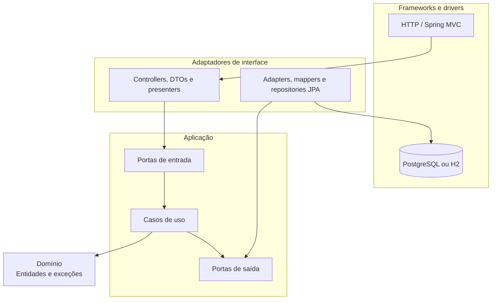

# Arquitetura

## Visão geral

A aplicação utiliza Clean Architecture para manter as regras de negócio independentes dos mecanismos de entrega e persistência. Spring, HTTP, JPA e PostgreSQL ficam nas camadas externas; entidades e casos de uso permanecem no núcleo.



## Camadas e responsabilidades

### `domain`

Contém entidades, invariantes e exceções do negócio. Não depende de Spring, HTTP ou JPA.

- `entity`: `User`, `UserType`, `Restaurant`, `MenuItem` e `Address`.
- `enums`: valores controlados do domínio.
- `exception`: erros de regra de negócio e recurso inexistente.

### `application`

Define o comportamento da aplicação e coordena o domínio.

- `port/in`: contratos expostos aos adaptadores de entrada.
- `port/in/command`: modelos de entrada independentes de HTTP.
- `service/impl`: implementação dos casos de uso.
- `port/out`: contratos de persistência exigidos pelos casos de uso.

### `presentation`

Traduz HTTP para os modelos da aplicação e transforma resultados em respostas públicas.

- `controller`: rotas REST e códigos HTTP.
- `dto/request` e `dto/response`: contrato externo da API.
- `presenter`: conversão de entidades de domínio em respostas.
- `exception`: tratamento global e contrato padronizado de erros.

### `infrastructure`

Implementa detalhes substituíveis e faz a composição da aplicação.

- `config`: criação e injeção dos casos de uso e configuração OpenAPI.
- `persistence/entity`: modelos JPA.
- `persistence/jpa`: repositories Spring Data.
- `persistence/mapper`: tradução entre modelos JPA e domínio.
- `persistence/adapter`: implementação das portas de saída.

## Fluxo de uma requisição

1. O controller valida o DTO recebido e o converte em um command.
2. A porta de entrada encaminha a operação ao caso de uso.
3. O caso de uso aplica regras do domínio e acessa dados por uma porta de saída.
4. Um adaptador JPA implementa essa porta e traduz domínio para persistência.
5. O presenter converte o resultado do domínio no DTO de resposta.
6. Exceções conhecidas são convertidas pelo handler global em respostas HTTP padronizadas.

## Estrutura do código

```text
src/main/java/com/restaurantsystem/restaurantmanagementapi
├── application
│   ├── port
│   │   ├── in
│   │   └── out
│   └── service/impl
├── domain
│   ├── entity
│   ├── enums
│   └── exception
├── infrastructure
│   ├── config
│   └── persistence
│       ├── adapter
│       ├── entity
│       ├── jpa
│       └── mapper
└── presentation
    ├── controller
    ├── dto
    ├── exception
    └── presenter
```

## Persistência

As relações principais são:

- vários usuários podem compartilhar um `UserType`;
- vários restaurantes podem pertencer a um `User` com perfil de proprietário;
- vários itens de cardápio podem pertencer a um `Restaurant`.

O PostgreSQL é utilizado em execução normal e o H2 no perfil de testes. O Hibernate mantém o schema com `ddl-auto=update`, enquanto `schema.sql` aplica compatibilidade de dados, índices e carga inicial. Mudanças de banco devem considerar que esse arquivo contém SQL específico do PostgreSQL.

## Proteção arquitetural

Os testes ArchUnit impedem dependências indevidas entre camadas. A suíte verifica, entre outras regras, a independência do domínio e o isolamento dos componentes de infraestrutura. Qualquer alteração estrutural deve passar por `mvn clean verify`.
